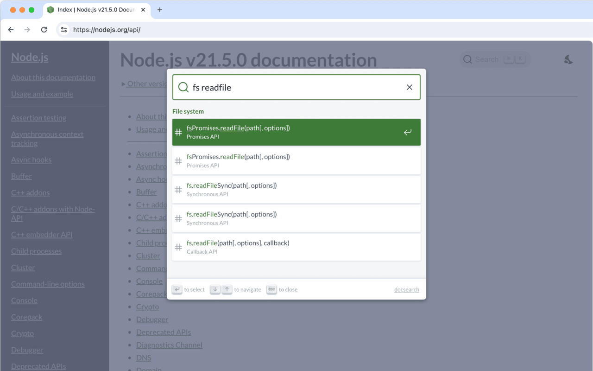

# Node.js 文档搜索

一个 chrome 插件，给 Node.js 文档页面加上即时搜索功能。

Node.js 的文档 (https://nodejs.org/api/) 没有搜索功能，只是单纯的文本页面，不像其他文档比如 Vue.js(https://vuejs.org/)，React(https://react.dev/) 等接入了 algolia 搜索框，能根据关键字快速定位到具体的页面或者方法。

该插件就是给 Node.js 文档页面加上搜索框，完美嵌入页面之中，就像原本就有一样，提供即时搜索能力，对齐其他文档的搜索体验。

## 预览效果

## 安装

- 从谷歌商店安装 [Chrome Web Store](https://chromewebstore.google.com/detail/aljljpbjhedenkebeampefpecogcgekb)
- 或者安装未打包插件: `docsearch/packages/chrome-extension`

## 使用方法

1. 安装插件后，打开 [Node.js 文档页面](https://nodejs.org/api/)，将会在页面右上角看到搜索按钮，点击它或者使用快捷键 Ctrl+k （Cmd+k）弹出搜索框
2. 或者点击插件按钮，如果当前tab是文档，就弹出搜索框，如果不是就打开文档

## 原理

- `docsearch/crawler` 是一个 Node.js 脚本，它爬取 Node.js 文档网站，并生成一个包含所有文档的 json 文件。
- 使用 `Fuse.js` 在 json 文件中搜索文档。
- `docsearch/packages/docsearch-react` 是一个搜索框 UI，从 [docsearch](https://github.com/algolia/docsearch) 分支出来，并修改以支持本地搜索。
- `docsearch/packages/nodejs-docsearch` 是一个 Chrome 扩展，它将搜索框 UI 注入到 Node.js 文档网站中。

## License

[MIT](LICENSE)
